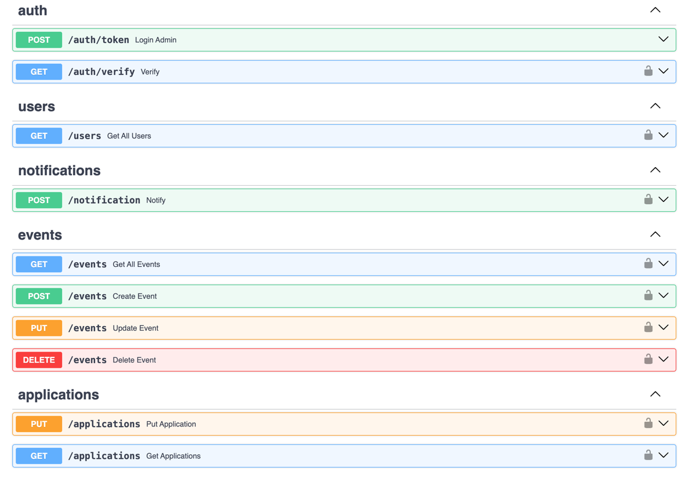

# Erudit bot

Erudit Bot is a Telegram bot that provides users with information about upcoming games, allows them to register for events, view their submitted applications, and more.  

- [Features](#features)
- [Used Technologies](#used-technologies)
- [Getting started](#running-with-docker)
- [API](#api)
- [License](#license)

---

## Features

- **Event Registration**: Users can sign up for upcoming games and track their applications.  
- **Event Notifications**: The bot sends reminders about upcoming events, registration deadlines, and other important updates.  
- **Data Management**: Stores user, event, and application data using PostgreSQL.  
- **Caching & State Management**: Utilizes Redis for optimized performance.  
- **Admin API**: Includes an API for bot management, allowing the development of an admin panel.  
- **JWT Authentication**: Secure access to the API with token-based authentication.  

For the admin panel implementation, see: [Admin Panel Repository](https://github.com/laviprog/erudit-admin).


## Used Technologies

* `Python 3.10+`
* `FastAPI`
* `Aiogram 3.17`
* `PostgreSQL`
* `Redis`
* `Docker`
* `JWT`

## Running with Docker

1. Clone the repository:
```sh
  git clone https://github.com/laviprog/erudit-bot.git
  cd erudit-bot
  ```
2. Create a `.env` file in the root directory and add the following environment variables:
```txt
  BOT_TOKEN=your_telegram_bot_token
  REDIS_HOST=redis
  REDIS_PORT=6379
  DB_HOST=postgres
  DB_PORT=5432
  DB_NAME=your_db_name
  DB_USER=your_db_user
  DB_PASSWORD=yout_db_password
  API_HOST=0.0.0.0
  API_PORT=8000
  SECRET_KEY=your_secret_key
  ADMIN_USERNAME=your_admin_username
  ADMIN_PASSWORD=your_admin_password
```
3. Build and run the Docker containers:
```sh
  docker-compose up --build -d
```

## API


## License

This project is licensed under the MIT License. See the [LICENSE](LICENSE) file for details.
